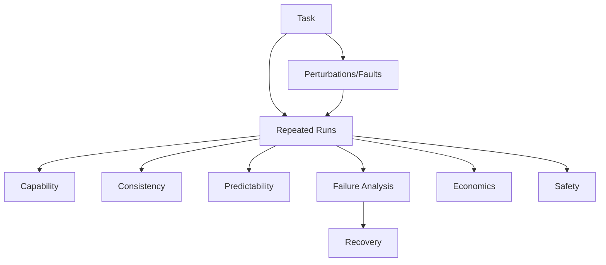

# Diagrams

```mermaid
flowchart TD
T[Task] --> R[Repeated Runs]
R --> C[Capability]
R --> K[Consistency]
R --> P[Predictability]
T --> X[Perturbations/Faults]
X --> R
R --> F[Failure Analysis]
F --> V[Recovery]
R --> E[Economics]
R --> S[Safety]
```
